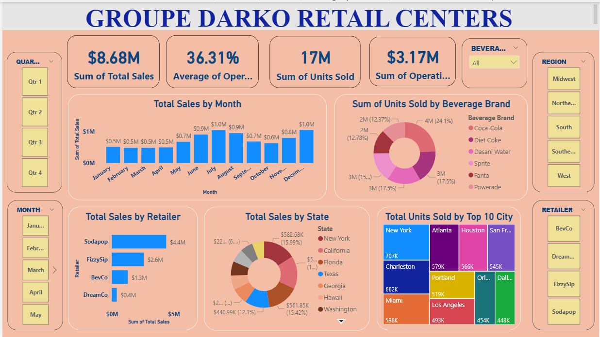

# Retail Store Analysis using Power BI
 In this project, I analyze records of data from a retail chain stores, Groupe Darko Retails.

# Project Details
| Code      | Project Name        |   Deployed File link |
|:-----------:|:-------------|:------|
|001|Retail Sore Analysis|      |

# Notes on Data
The following are details of the data used for the project.
**Retailer:**The name of the sub-retailer.
**RetailID:**The idenstification number of the sub-retailer.
**Invoice date:**Date on which invoice was issued
**Region:**The region where sub-retailer is located.   
**State:**The state where sub-retailer is located. 
**City:**The city where sub-retailer is located. 
**Beverage brand:**The brand name of beverages sold by sub-retailers.
**Price per unit:**The cost of a single beverage.
**Units sold:**The quantity of beverages sold by a sub-retailer on a particular date.
**Total Sales:**The product of units sold and price per unit by a retailer on a specified date.
**Operating profit:** 
**Operating margin:** 

# Screenshot of Power BI Analysis

# Insights from Analysis

# Recommendations

# Author and Contributors
Elvis Darko